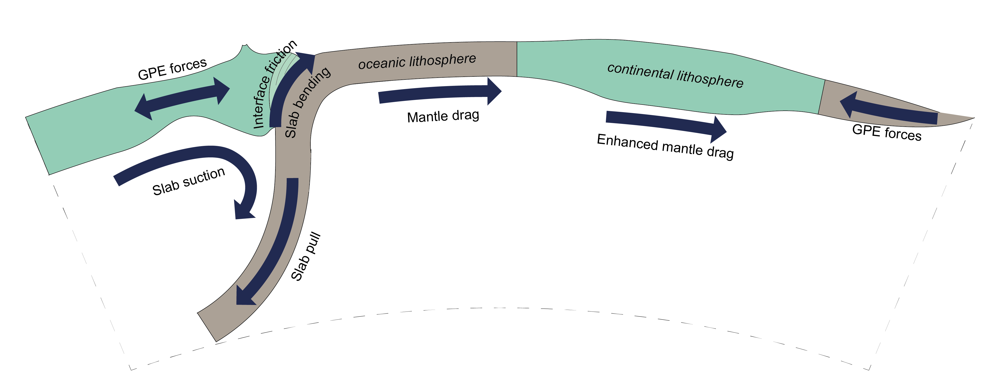

#################
Plato
#################

These pages provide the documentation of the `Plato` python package. 
`Plato` was developed to provide a simple, flexible, and efficient way to perform geodynamic analyses of global plate reconstructions in GPlates.
Here you'll find the relevant documentation as well as a set of notebooks with examples of such analyses.

    Optional caption for the figure.

Plato is tested on Python 3.10.12. In theory, it should work well on any system that has
access to Conda. 

Quickstart
----------

To install Plato, run the following:

.. code-block:: bash    

    > $ git clone https://github.com/thomas-schouten/plato.git
    > $ cd plato
    > $ conda env create -f environment.yml
    > $ conda activate plato
    > $ pip install -e .

This will create a Conda environment with `Plato` and all required dependencies, which should be able to run all notebooks found on the GitHub repository.

.. toctree::
    :maxdepth: 1
    :caption: Contents:
    :hidden:

    self
    plato
    api/index
    genindex

.. centered:: Thomas Schouten, 2024

